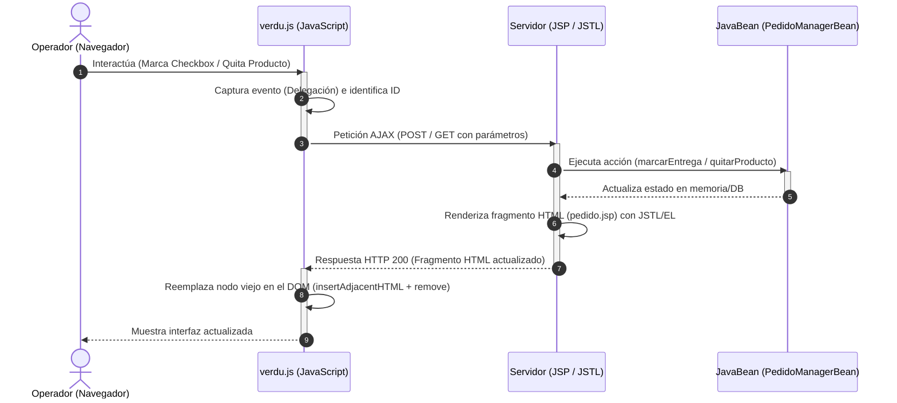

# Guía de Estudio y Explicación Técnica: Administración de Pedidos "Cherries"

Esta guía explica en detalle la arquitectura, el flujo de datos y los conceptos técnicos aplicados en la resolución de la administración de pedidos para la Verdulería "Cherries". Está diseñada para servir como material de estudio teórico-práctico de cara al examen parcial de Programación Distribuida / Programación Web.

---

## 1. Arquitectura General y Flujo de Información

El proyecto implementa una arquitectura basada en **MVC (Modelo-Vista-Controlador)** desacoplado mediante **AJAX (Asynchronous JavaScript and XML)**. El intercambio de datos se realiza sin recargar la página completa, logrando una experiencia de usuario fluida y reactiva.



### El ciclo de vida de la petición:
1. **Acción del Usuario:** El usuario interactúa con la grilla (por ejemplo, hace click en el checkbox de entrega).
2. **JavaScript (Controlador del Cliente):** 
   - El evento se propaga hasta el contenedor general (`#contenedorPedidos`) gracias a la **Delegación de Eventos**.
   - JavaScript intercepta el evento, extrae las variables del DOM (como el ID del pedido y si está chequeado) y construye los datos.
   - Envía una petición HTTP asíncrona (`fetch`) a un JSP de control (`check.jsp`).
3. **Servidor JSP (Controlador del Servidor):**
   - El JSP recibe los parámetros y los traduce al tipo correspondiente de forma implícita.
   - Invoca el método lógico en el **JavaBean** (`PedidoManagerBean`) para cambiar el estado.
   - Se localiza el pedido actualizado en la lista y se deposita en el **Request Scope** bajo el atributo `"pedido"`.
   - Se incluye dinámicamente el fragmento `pedido.jsp`.
4. **JSTL y EL (Motor de Plantillas):**
   - `pedido.jsp` lee el pedido del Request Scope y genera el código HTML correspondiente a esa tarjeta utilizando expresiones lógicas para calcular badges de estado, clases tachadas y visibilidad de botones.
   - El JSP de control devuelve el HTML resultante al navegador.
5. **DOM (Actualización Visual):**
   - JavaScript recibe el HTML en la promesa del `fetch`.
   - Busca el elemento de la tarjeta afectada, inserta el nuevo HTML antes de ella usando `.insertAdjacentHTML('beforebegin', html)` y elimina la tarjeta vieja con `.remove()` (alternativa estándar y recomendada sobre `.outerHTML`).
   - Si ocurre un error, el bloque `catch` revierte el estado visual del control y notifica al usuario en la cabecera.

---

## 2. El Lado del Cliente (El Navegador - JavaScript)

El archivo `verdu.js` actúa como el controlador del lado del cliente. Su responsabilidad es capturar interacciones, comunicarse de manera asíncrona y actualizar el DOM de forma quirúrgica.

### A. Delegación de Eventos (Event Delegation)
En lugar de asociar un escuchador de eventos a cada checkbox y botón de la página (lo cual fallaría al insertar HTML dinámicamente), asociamos los eventos directamente a un ancestro común estable que nunca se destruye: el contenedor con ID `contenedorPedidos`.

```javascript
document.getElementById('contenedorPedidos').addEventListener('change', async function (event) { ... });
document.getElementById('contenedorPedidos').addEventListener('click', async function (event) { ... });
```
* **`event.target`:** Es el elemento HTML exacto donde ocurrió el evento (por ejemplo, el botón clickeado o el checkbox modificado).
* **`event.target.closest('.card')`:** Busca el ancestro más cercano que tenga la clase `.card`. Esto nos permite ubicar la "tarjeta" completa del pedido actual para poder reemplazarla.

### B. Estructura de la Petición AJAX (Fetch API)
Para comunicarnos con los archivos JSP, se utiliza la función moderna `fetch`.
* **Content-Type (`application/x-www-form-urlencoded`):** Le indica al servidor que los datos viajan codificados en formato de parámetros de formulario estándar (`clave1=valor1&clave2=valor2`), lo que facilita su lectura en Java usando `request.getParameter()`.
* **Body (Cuerpo):** Construimos la cadena dinámicamente usando plantillas de texto (Template Literals):
  ```javascript
  body: `id=${id}&checked=${checked}&expand=${isExpanded}`
  ```

### C. Reemplazo del DOM y Rollback
* **`card.insertAdjacentHTML('beforebegin', html)` y `card.remove()`:** Reemplaza el elemento DOM completo (la tarjeta del pedido) insertando el nuevo HTML como hermano previo y eliminando el nodo anterior. Esto logra el reemplazo completo de forma segura y estándar.
* **Rollback:** Si la promesa de `fetch` falla o el servidor devuelve un código de error (como 500), se ejecuta la sección `catch`, donde se restaura el checkbox a su valor lógico opuesto:
  ```javascript
  target.checked = !checked;
  ```

---

## 3. El Lado del Servidor (JSP, JSTL y EL)

El servidor procesa la lógica de presentación utilizando **JSTL (JavaServer Pages Standard Tag Library)** y **EL (Expression Language)**. Se evita estrictamente el uso de Scriptlets (`<% ... %>`) para mantener el código limpio y mantenible.

### A. Comunicación entre JSPs mediante el Request Scope
El JSP incluido (`pedido.jsp`) requiere del objeto `PedidoBean` para renderizar el HTML.
* **El Problema:** La etiqueta `<jsp:param>` solo puede transmitir cadenas de texto (Strings). Si intentamos pasar una lista de productos (`ped.productos`), JSP la convertirá a texto plano, destruyendo el objeto de tipo colección y rompiendo el bucle.
* **La Solución:** Guardar el objeto en el ámbito de la petición (**Request Scope**) usando JSTL:
  ```jsp
  <c:set var="pedido" value="${ped}" scope="request"/>
  <jsp:include page="pedido.jsp"/>
  ```
  Dado que el JSP incluido se ejecuta bajo el mismo hilo y contexto de petición HTTP, puede acceder al objeto original escribiendo `${pedido}` en Expression Language conservando sus tipos de datos y colecciones Java.

### B. Invocación de Métodos de JavaBean usando EL 3.0+
En versiones modernas de Expression Language, es posible invocar métodos que reciben argumentos directamente desde una expresión:
```jsp
${listado.marcarEntrega(param.id, param.checked)}
${listado.quitarProducto(param.pedidoId, param.productoId)}
```
* **Coerción Automática:** EL convierte automáticamente el String `param.id` en `int` y el String `param.checked` en `boolean` para que coincidan con la firma del método en la clase Java.
* **Flujo de Excepciones:** Si el método lanza una excepción (por ejemplo, porque el producto ya estaba eliminado), el JSP fallará devolviendo un código HTTP 500, permitiendo que el JavaScript del navegador intercepte el error y dispare el rollback del checkbox.

### C. Operadores Lógicos y Estructuras en JSTL
Dentro de `pedido.jsp` se utilizan varias etiquetas claves de JSTL y EL:

1. **`<c:set var="limite" value="${param.expand == 'true' ? 1000 : 4}"/>`**
   - Evalúa de forma condicional si se debe expandir la lista. Si el parámetro `expand` es `'true'`, establece la propiedad `end` del bucle en 1000 (para mostrar todos). Si es falso, la establece en 4 (para mostrar los primeros 5 elementos, índices 0 a 4).

2. **`<c:forEach var="prod" items="${pedido.productos}" end="${limite}">`**
   - Recorre la lista de productos del pedido desde el índice 0 hasta el valor de la variable `limite`.

3. **Clases Condicionales con EL:**
   - Para tachar y colorear de rojo los productos rechazados:
     ```jsp
     <tr class="${prod.rechazado ? 'text-danger text-decoration-line-through' : ''}">
     ```

4. **`<c:choose>` y `<c:if test="${pedido.listoEntrega}">`**
   - Evalúa si se debe renderizar el distintivo (badge) de entrega. En su interior, utiliza `<c:choose>`, `<c:when>` y `<c:otherwise>` para alternar el estilo visual (badge verde `bg-success` si está completo, o badge amarillo `bg-warning text-dark` si está parcialmente completo):
     ```jsp
     <c:choose>
       <c:when test="${pedido.completo}">
         <span class="badge bg-success ms-2">Completo para entrega</span>
       </c:when>
       <c:otherwise>
         <span class="badge bg-warning text-dark ms-2">Parcialmente completo para entrega</span>
       </c:otherwise>
     </c:choose>
     ```

5. **Visibilidad del Botón "Ver más":**
   - Solo se muestra si el total de productos es mayor a 5 y si no está actualmente expandido:
     ```jsp
     <c:if test="${pedido.cantidadProductos > 5 && param.expand != 'true'}">
     ```

---

## 4. Persistencia ante Recarga (F5)

Una de las condiciones del ejercicio es que al presionar F5 los cambios persistan pero las tarjetas vuelvan a mostrar inicialmente solo 5 productos.

* **Persistencia:** Al realizar los cambios mediante peticiones AJAX a `check.jsp` y `quitar.jsp`, estas llaman directamente a los métodos del JavaBean `PedidoManagerBean` (`marcarEntrega` y `quitarProducto`), modificando el estado de los objetos Java en el servidor (que se encuentran guardados en el ámbito `application`).
* **Visualización de 5 productos en F5:** Al presionar F5, el navegador realiza una petición GET clásica sobre `index.jsp`. Como no se le está enviando ningún parámetro `expand=true`, el valor del límite de `pedido.jsp` se evalúa de manera predeterminada en 4 (mostrando 5 productos), cumpliendo con el requerimiento.
